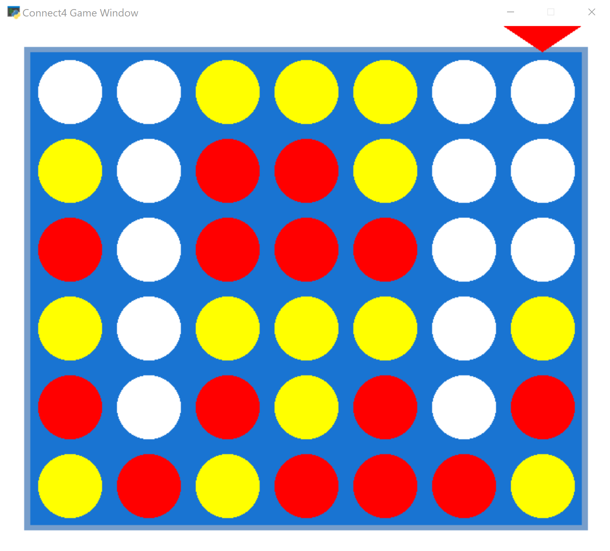

# Connect 4 Champion ~ c4champion

Reinforcement learning project teaching an autonomous system to master the traditional 1974 game of connect 4.

Part of this project is a gameplay implemented using the [The Python Arcade Library](http://arcade.academy/index.html).

Connect 4 is a *first player win* game by starting in the middle column, and a theoretical draw when the first player starts in the column adjacent to the center ([https://en.wikipedia.org/wiki/Connect_Four](https://en.wikipedia.org/wiki/Connect_Four)).
